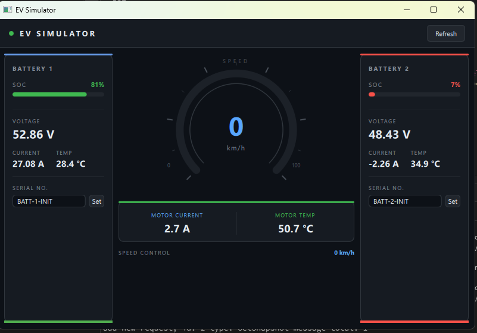

# EV Simulator

Ứng dụng mô phỏng hành vi của một cụm điều khiển xe điện bằng Qt/QML. Dự án tập trung vào việc tái hiện các đại lượng giả lập thường gặp từ bộ điều khiển EV như mức pin (SOC), điện áp, dòng điện, nhiệt độ, tốc độ motor và trạng thái cập nhật theo thời gian thực.



## Mục tiêu dự án

- Mô phỏng dữ liệu thiết bị EV trong môi trường desktop để phục vụ demo UI, kiểm thử luồng dữ liệu và xác thực kiến trúc giao tiếp giữa UI với backend.
- Tách rõ phần backend xử lý bất đồng bộ, thread-safe, non-blocking khỏi phần QML chuyên trách hiển thị giao diện.
- Giữ cho UI phản hồi mượt ngay cả khi các lệnh `set` được mô phỏng có độ trễ phần cứng.

## Kiến trúc tổng thể

Luồng dữ liệu của ứng dụng đi theo hướng:

`QML UI -> Controller -> UiBackend -> MessageBus -> Device worker thread -> HardwareService -> Sim drivers`

Chiều phản hồi:

`Sim drivers -> HardwareService snapshot -> Device -> MessageBus -> UiBackend -> Controller -> QML UI`

### Backend: thread-safe và non-blocking

Phần backend được tổ chức để UI không gọi trực tiếp vào logic thiết bị:

- `lib/messageQueue/`
  - Cung cấp `ThreadSafeQueue` và `MessageBus`.
  - Request/response được đẩy qua queue an toàn luồng.
  - Callback phản hồi chỉ được bơm về UI thread qua `uiPumpResponses()`.
- `devices/`
  - Chứa `Device`, một worker chạy trên `std::thread`.
  - Worker đợi request bằng timed wait, tránh busy loop và tránh block UI thread.
  - Các lệnh `set` được xử lý theo kiểu `begin -> delayed finalize` để mô phỏng độ trễ phần cứng.
- `middleware/`
  - `HardwareService` quản lý snapshot phần cứng và đồng bộ bằng `std::mutex`.
  - Snapshot được copy ra an toàn khi UI hoặc worker cần đọc.
- `board/`
  - Driver mô phỏng cho battery và motor.
  - Sinh dữ liệu giả lập như điện áp, dòng điện, nhiệt độ và tốc độ.

Các quyết định thiết kế chính:

- Thread-safe snapshot:
  - `HardwareService` giữ snapshot dùng chung và bảo vệ bằng mutex.
- Non-blocking UI:
  - QML và Qt UI không chờ driver hay worker hoàn tất.
  - `UiBackend` dùng `QTimer` để bơm callback và đồng bộ dữ liệu định kỳ.
- Delayed operation simulation:
  - Các thao tác như đổi serial hoặc set tốc độ không áp dụng ngay, mà hoàn tất sau khoảng trễ mô phỏng.
- Bounded processing:
  - Device worker drain request theo batch nhỏ, giữ nhịp xử lý ổn định.

## QML/UI: tập trung hiển thị

Phần QML được giữ đúng vai trò của lớp hiển thị:

- Hiển thị dashboard cho 2 battery và 1 motor.
- Render các chỉ số:
  - SOC
  - Voltage
  - Current
  - Temperature
  - Speed
  - Serial number
- Cung cấp các thao tác UI:
  - Refresh snapshot
  - Set serial cho từng battery
  - Điều chỉnh speed bằng slider
- Tập trung vào trải nghiệm hiển thị:
  - Gauge cho tốc độ
  - Progress bar cho SOC
  - Màu trạng thái theo ngưỡng cảnh báo
  - Layout responsive cho màn hình hẹp/rộng

QML không giữ logic mô phỏng phần cứng; dữ liệu được đưa vào qua `Controller` và `UiBackend`.

## Cấu trúc thư mục

```text
Qt_vehicle_simulator/
|-- board/                # Driver mô phỏng battery và motor
|-- controller/           # Bridge giữa QML và backend
|-- devices/              # Worker thread xử lý request thiết bị
|-- lib/messageQueue/     # Queue thread-safe và message bus
|-- middleware/           # HardwareService và snapshot phần cứng
|-- qml/                  # Main.qml, page và component hiển thị
|-- test_worker/          # Chương trình kiểm thử worker/message flow
|-- ui/                   # UiBackend giao tiếp với MessageBus
|-- CMakeLists.txt        # Cấu hình build chính
|-- main.cpp              # Composition root của ứng dụng
`-- qml.qrc               # Qt resource cho giao diện
```

## Vai trò từng lớp

### `main.cpp`

- Khởi tạo `MessageBus`.
- Lắp ghép simulated drivers, `HardwareService`, `Device`, `UiBackend`, `Controller`.
- Nạp `Main.qml` và expose `controller` cho QML.

### `controller/`

- Cung cấp `Q_PROPERTY` cho QML.
- Nhận signal từ `UiBackend` và cập nhật state cho giao diện.
- Phơi ra `Q_INVOKABLE` để QML gọi `refresh`, `setSpeed`, `setBattery1Serial`, `setBattery2Serial`.

### `ui/`

- `UiBackend` là lớp backend phía UI.
- Gửi request bất đồng bộ qua `MessageBus`.
- Nhận phản hồi và phát signal `snapshotUpdated`, `operationCompleted`.

### `devices/`

- `Device` chạy vòng lặp worker độc lập.
- Nhận request từ queue.
- Gọi `HardwareService`.
- Post response trở lại UI mà không để UI chờ block.

### `middleware/`

- Chuẩn hóa dữ liệu thiết bị thành `HwSnapshot`.
- Tính toán thêm các giá trị dẫn xuất, ví dụ SOC từ điện áp.
- Đảm bảo snapshot nhất quán khi đọc/ghi đa luồng.

### `board/`

- Cung cấp driver mô phỏng phần cứng:
  - `SimBatteryDriver`
  - `SimMotorDriver`
- Sinh dữ liệu giả lập để dashboard luôn có tín hiệu động.

## Đại lượng mô phỏng

Ứng dụng hiện mô phỏng các tín hiệu cơ bản của hệ thống EV:

- Battery 1 / Battery 2
  - Serial number
  - SOC
  - Voltage
  - Current
  - Temperature
- Motor
  - Speed
  - Current
  - Temperature

Các giá trị này là dữ liệu giả định từ bộ điều khiển xe điện, phù hợp cho việc trình diễn UI, demo flow điều khiển và kiểm thử giao tiếp phần mềm trước khi nối với phần cứng thật.

## Build

Yêu cầu:

- Qt 6
- CMake 3.16+
- Compiler hỗ trợ C++17

Build cơ bản:

```bash
cmake -S . -B build
cmake --build build
```

## Gợi ý mở rộng

- Thay simulated drivers bằng driver giao tiếp CAN/UART thật.
- Thêm cảnh báo lỗi pin/motor và fault code.
- Ghi log timeline cho request/response để benchmark worker.
- Thêm test cho message ordering, stop flow và delayed operation.

## Ghi chú

`test_worker/` là ví dụ nhỏ để kiểm tra riêng cơ chế worker, queue và delayed response mà không cần chạy toàn bộ UI Qt/QML.
